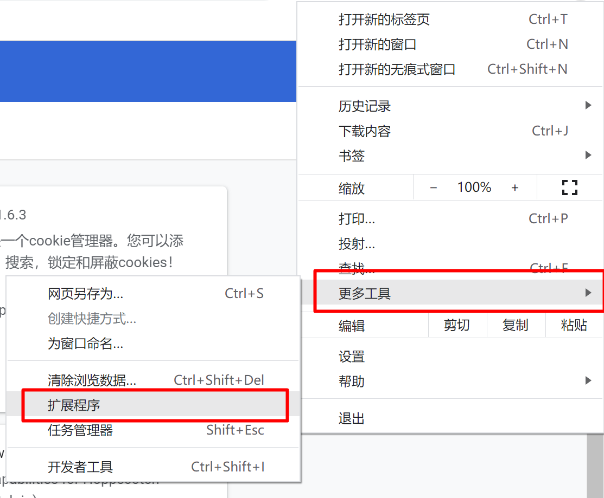
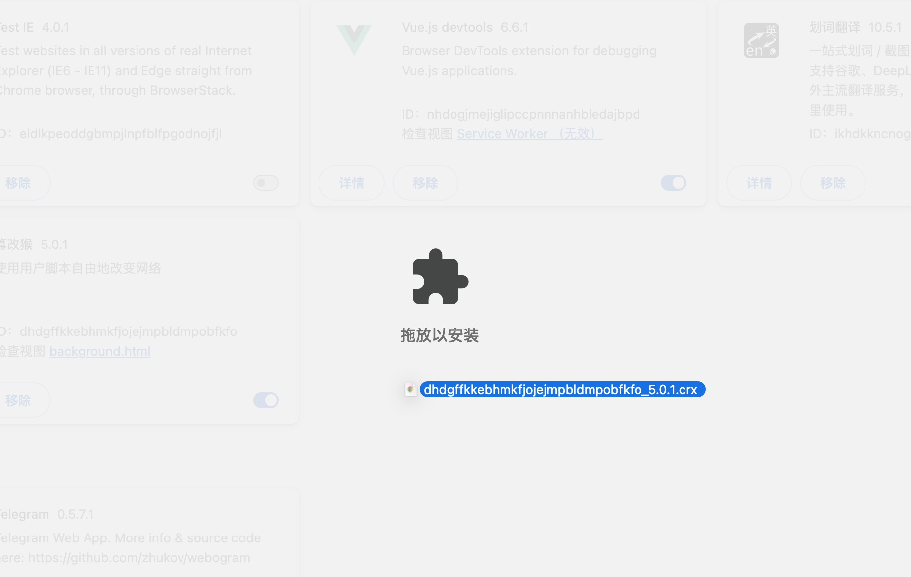
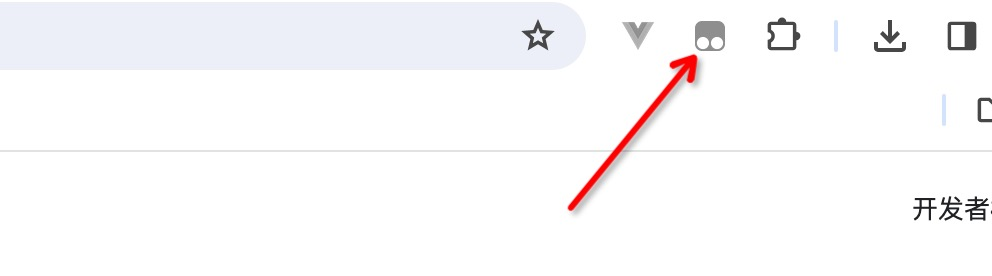
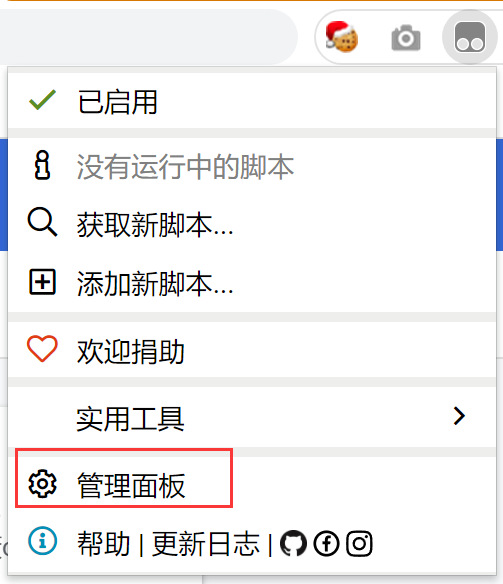
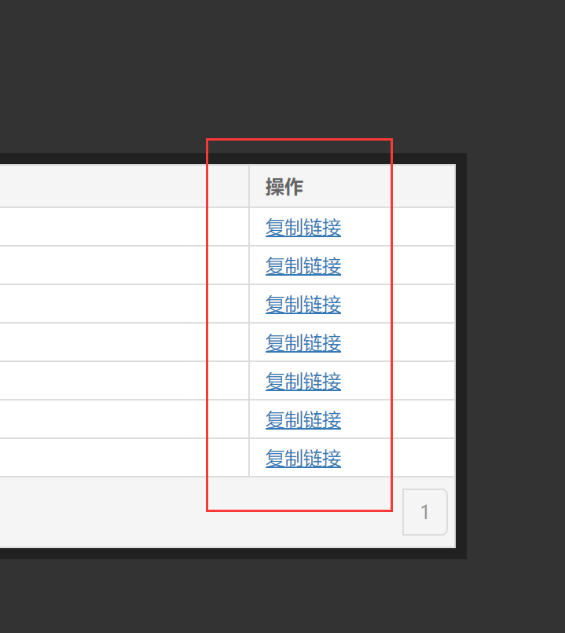
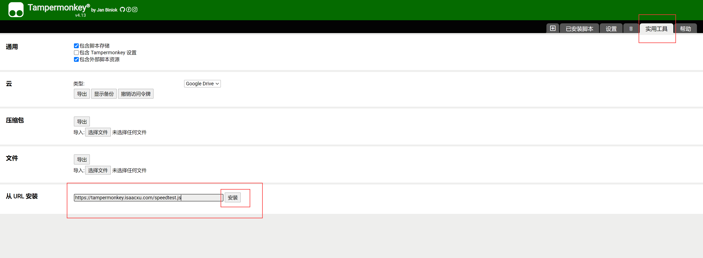
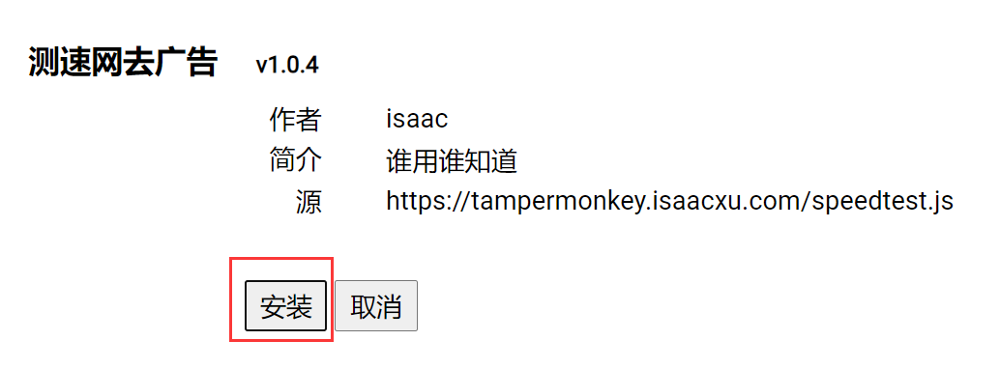
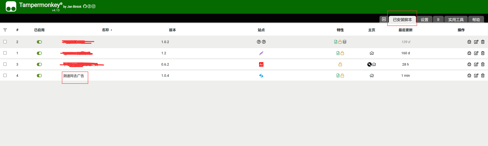

# mtMonkeyJs

[在线脚本目录](https://server.isaacxu.com:4443/tampermonkey/)
## 脚本安装

1. 下载插件离线包
地址：[https://server.isaacxu.com:4443/tampermonkey/dhdgffkkebhmkfjojejmpbldmpobfkfo_5.0.1.crx](https://app.xdo.icu/tampermonkey/dhdgffkkebhmkfjojejmpbldmpobfkfo_5.0.1.crx)

2. 安装插件

点击chrome浏览器右上角的“...”

点击”更多工具-扩展程序“

进入扩展程序主页面

拖动第一步下载下来的crx文件，拖动至插件主界面

拖动完成后，浏览器会打开插件主页面，我们先把这个页面关掉，还是进入插件主界面，进行下一步操作。

3. 导入脚本

安装成功后，在浏览器右上角会出现该插件的图标，点击该图标，在弹出菜单上点击”管理面板“按钮

打开[脚本目录](https://server.isaacxu.com:4443/tampermonkey/)，在脚本列表界面选择需要安装的脚本，点击”复制链接“。

切换到tampermonkey管理面板的”实用工具“标签，粘贴刚才复制的地址

在弹出的脚本详情页面，点击”安装“按钮

切换到tampermonkey管理面板的”已安装脚本“标签，刷新页面，查看脚本是否已经安装成功

4. 验证
打开你要应用插件的网站，网站打开后，如果插件运行了，浏览器右上角其图标会显示如下：

