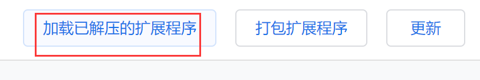
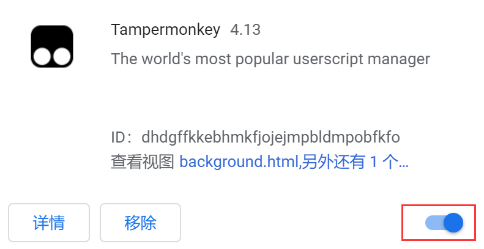

# mtMonkeyJs

[在线脚本目录](https://tampermonkey.isaacxu.com)
## 脚本安装

1. 下载插件离线包
地址：[https://app.isaacxu.com/tampermonkey/Tampermonkey.zip](https://app.isaacxu.com/tampermonkey/Tampermonkey.zip)。

2. 安装插件
* 解压压缩包Tampermonkey.zip
* 打开chrome插件程序页面

点击chrome右侧更多按钮

点击”更多工具-扩展程序“

点击”加载已解压的扩展程序“

插件加载完成后可刷新这个页面，若没有启用，可以手动启用

3. 导入脚本

在浏览器右上角”tampermonkey“的图标，在弹出菜单上点击”管理面板“按钮

打开[脚本目录](https://tampermonkey.isaacxu.com/)，在脚本列表界面选择需要安装的脚本，点击”复制链接“。

切换到tampermonkey管理面板的”实用工具“标签，粘贴刚才复制的地址

在弹出的脚本详情页面，点击”安装“按钮

切换到tampermonkey管理面板的”已安装脚本“标签，刷新页面，查看脚本是否已经安装成功

